## kami

<!-- Cada imagem vai dentro de um <a>: imagem solta o GitHub embrulha num link
     target="_blank" para o próprio arquivo, e o clique abre o SVG numa aba nova. -->

  
  
  
  
  
  
  
  

  
  
  
  
  
  
  

##

  
  
  

##

<!-- Gerados por .github/workflows/cards.yml e versionados em profile/. Para voltar
     a exibir as estatísticas, que seguem sendo geradas, basta colar:
     
     A sequência é o único card que vem de serviço externo: a Action não gera esse tipo. -->

